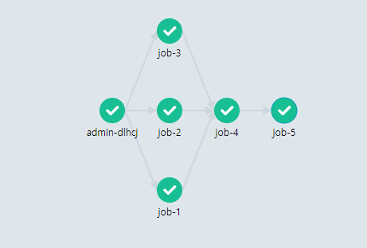

# Basic

## Run by command

Clone `jupyterflow` git repository and go to [examples/basic](https://github.com/hongkunyoo/jupyterflow/tree/main/examples/basic).

```bash
git clone https://github.com/hongkunyoo/jupyterflow.git
cd examples/basic

ls -alh
# hello.sh
# workflow.yaml
```

- `hello.sh`: Script to run in workflow.
- `workflow.yaml`: workflow file

`hello.sh` script looks like this. it simply echos argument.

```bash
# hello.sh
echo "Hello $1"
```

Run `jupyterflow` with `-c` option for simple command.

```bash
jupyterflow run -c "bash hello.sh world >> echo 'good bye'"
```

Go to Argo Web UI and check out the output of launched workflow.


## Run by `workflow.yaml`

Write `workflow.yaml` for parallel execution.

```yaml
# workflow.yaml
jobs:
- bash hello.sh world
- bash hello.sh bob
- bash hello.sh foo
- ls
- echo 'jupyterflow is the best!'

# Job index starts at 1.
dags:
- 1 >> 4
- 2 >> 4
- 3 >> 4
- 4 >> 5
```

Run `jupyteflow` with `-f` option.

```bash
jupyterflow run -f workflow.yaml
```

Check out the result.

