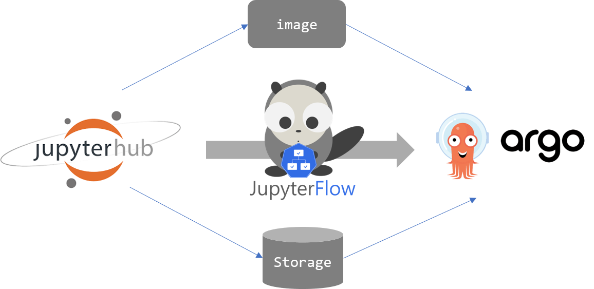

# How it works



JupyterFlow has a strict constraint that it only works on JupyterHub deployed on Kubernetes.
Because of this constraint, JupyterFlow can easily collect current environment information(metadata) using attached service account.
With this information, `jupyterflow` constructs Argo `Workflow` object on behalf of you.

`jupyterflow` uses following metadata from jupyter notebook `Pod`.

- Container image
- Environment variables
- Home directory (home `PersistentVolumeClaim`)
- Extra volume mount points
- Resource management (`requests`, `limits`)
- NodeSelector
- UID, GUID
- Etc.

Following pseudo code might help you understand how `jupyterflow` works.

```python
# collect meta data of current environment.
notebook_pod_spec = get_current_pod_spec_from_k8s(pod_name, service_account)

# build workflow based on meta data and user workflow information.
workflow_spec = build_workflow(notebook_pod_spec, user_workflow_file)

# create Argo workflow.
response = request_for_new_workflow_to_k8s(workflow_spec, service_account)
```
